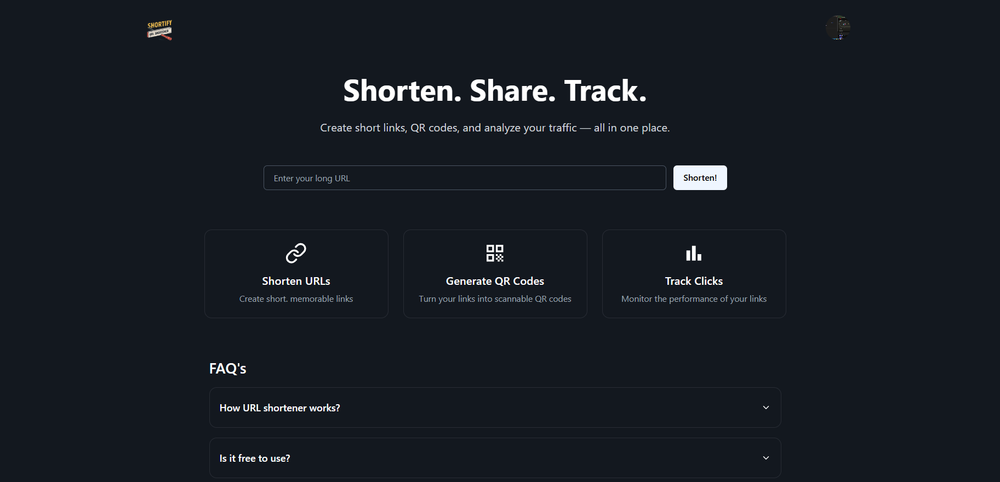
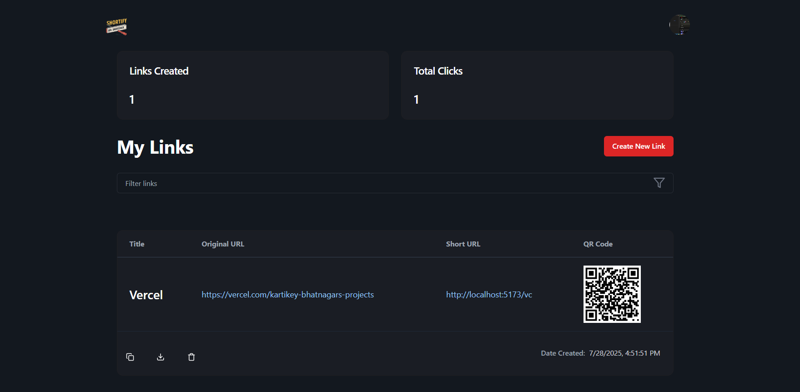
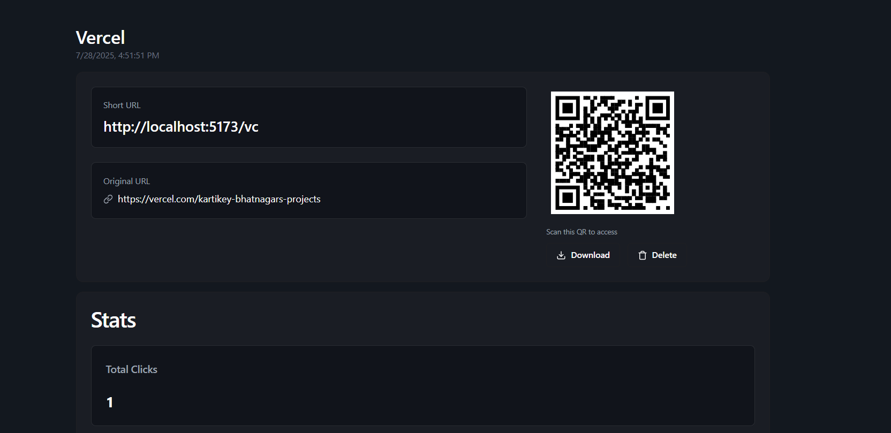

🔗 URL Shortener — Track & Manage Your Links

A minimal, fast, and fully functional URL shortener built using **React**, **Supabase**, and **Vite**.  
Shorten long URLs, get analytics, and manage your links through a clean dashboard — all in one place.

---

## 📌 Preview

**Live Site** → [https://tiny-ur-lz.vercel.app](https://tiny-ur-lz.vercel.app)  
**Repo** → [https://github.com/kartikey2004-git/URL-Shortener](https://github.com/kartikey2004-git/URL-Shortener)

---

## ⚙️ Tech Stack

| Layer       | Tools Used                               |
|-------------|----------------------------------        |
| Frontend    | React.js, Vite, JavaScript, Tailwind CSS |
| Backend     | Supabase (PostgreSQL, Auth, Realtime)    |
| Utilities   |                                          |

---

## ✨ Key Features

- 🔗 **Instant URL Shortening**  
  Cleanly shorten long and messy URLs to compact links.

- 📊 **Analytics Dashboard**  
  Track clicks, device types, timestamps, and more for each shortened URL.

- 🔐 **User Auth with Supabase**  
  Only authenticated users can create, view, and manage their links.

- 🧾 **Link Management System**  
  Edit or delete your links from a personalized dashboard.

- 📱 **Responsive Design**  
  Fully functional across mobile, tablet, and desktop.

---

##  Snapshots

| Home Page | Dashboard | Link Analytics |
|-----------|-----------|----------------|
|  |  |  |

---

## 🧠 Project Overview

The project follows a frontend-first architecture with Supabase acting as the backend for authentication, real-time database handling, and analytics.

**Supabase Handles:**
- Row-level security for users
- Realtime tracking for click counts
- User session management

**Frontend Handles:**
- Link input + validation
- Client-side routing (React Router)
- Auth state and protected pages
- Responsive UI and animations

---

## 🚀 Getting Started Locally

### Clone the repo:
```bash
git clone https://github.com/your-username/url-shortener.git
cd url-shortener
```

### Install dependencies
```bash
npm install
```

### Add your Supabase keys

```bash
.env

VITE_SUPABASE_URL=your-supabase-url
VITE_SUPABASE_ANON_KEY=your-anon-key
```

### Run locally
```bash
npm run dev
```


🗂️ Folder Structure
```php

url-shortener/
├── src/
│   ├── components/        # UI components
│   ├── pages/             # Main views (Home, Dashboard)
│   ├── services/          # Supabase client + API functions
│   ├── utils/             # Helper functions
│   └── App.jsx            # App entry point with routing
└── public/
    └── snapshots/         # Project snapshots
```


**Features**

 - Add custom slugs for shortened links

 - Add QR code generation

 - Better analytics visualization (charts)
---

## License: This project is open-source. Feel free to explore, use, and contribute!

